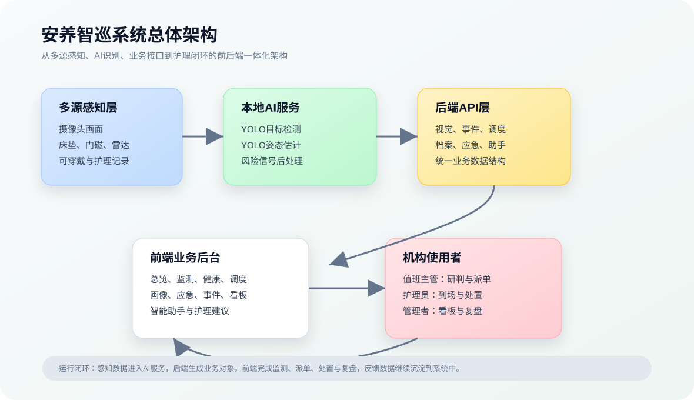
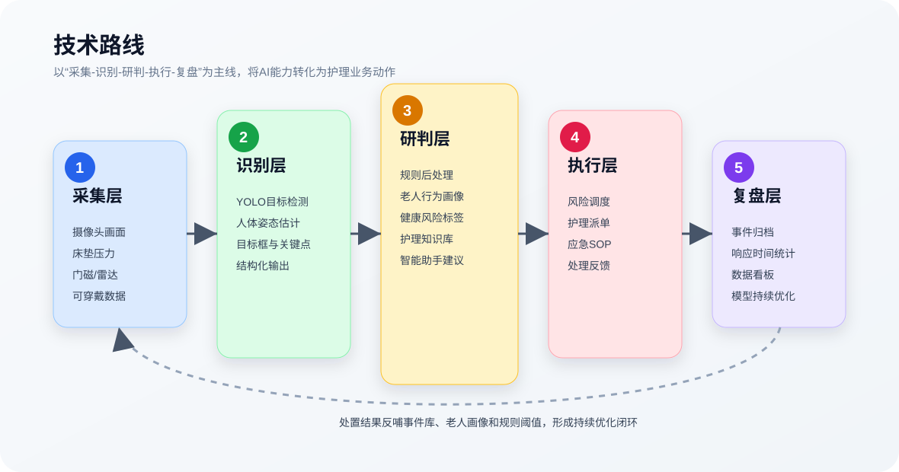
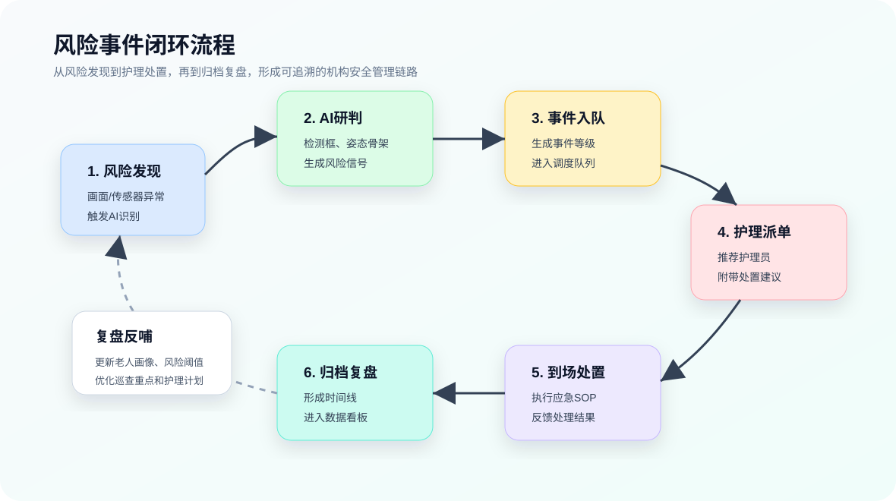

# 安养智巡：康养机构AI安全风险预警系统项目研究报告

副标题：**康养机构AI安全风险预警系统**

本项目面向养老院、疗养院、康养中心等机构的日常安全管理场景，构建一套融合计算机视觉、姿态估计、行为画像、护理知识库与智能辅助决策能力的安全风险预警系统。系统以值班主管、护理员和机构管理者为核心用户，围绕“实时监测、风险识别、事件研判、护理派单、应急处置、归档复盘”的业务闭环展开，目标是在不改变机构原有护理流程的前提下，提高风险发现效率、护理响应速度和管理可追溯性。

## 一、项目摘要

随着人口老龄化程度持续加深，康养机构面临的安全管理压力不断上升。跌倒、夜间离床、久卧未动、异常滞留、突发疾病等风险具有突发性、隐蔽性和高后果性，传统依赖人工巡房和事后记录的方式容易出现发现滞后、响应不及时、处置流程不完整、复盘依据不足等问题。尤其在夜间、交接班、护理员同时负责多个区域时，单纯依赖人工经验难以实现持续、稳定、可追溯的风险管理。

本项目设计并实现的“安养智巡”系统以康养机构真实值班业务为背景，将摄像头画面、床垫传感器、门磁、毫米波雷达、可穿戴设备、护理记录等数据纳入统一管理思路。系统前后端主体功能已经完成，前端已实现运营总览、实时监测、健康监护、风险调度、行为画像、应急流程、事件管理、数据看板和智能助手等核心页面，后端已完成对应 API 层、业务数据结构和本地 AI 视觉服务封装，可在当前环境中完成从 AI 识别、风险展示、事件管理到护理辅助决策的完整业务流程。实时监测模块已接入本地 FastAPI 视觉服务，基于 YOLO11n 目标检测模型和 YOLO11n-pose 姿态估计模型，对画面中的人员、床位、家具和人体关键点进行识别，并在页面上叠加检测框、姿态骨架和风险信号。后续系统可在现有前后端架构基础上继续对接真实数据库、设备网关和大模型服务。

项目的核心思路不是单独开发一个跌倒检测模型，也不是制作一个普通聊天机器人，而是将 AI 识别结果转化为康养机构可以直接执行的业务动作：生成风险事件、判断优先级、推荐护理员、匹配应急预案、形成处置记录，并通过数据看板和行为画像支撑后续复盘。系统强调“让用户看到风险、依据和下一步动作”，使 AI 能力真正嵌入机构安全管理流程。

### 报名表项目简介（400字以内）

“安养智巡”是一套面向康养机构的AI安全风险预警系统，应用于养老院、疗养院、康养中心等场景。项目针对老人跌倒、夜间离床、久卧未动、异常滞留、突发疾病等风险，构建“实时监测-风险识别-事件研判-护理派单-应急处置-归档复盘”的闭环管理流程。系统前后端主体功能已完成，前端实现运营总览、实时监测、健康监护、风险调度、行为画像、应急流程、事件管理、数据看板和智能助手等页面，后端实现API接口、业务数据结构和本地YOLO视觉识别服务，可正常运行并完成核心业务流程。项目创新点在于将计算机视觉、行为画像、护理知识库和智能决策辅助结合到真实值班后台中，把AI判断转化为可执行的派单、预案和复盘记录。后续将进一步接入真实设备、数据库、模型微调和机构试点。项目经费主要来自团队自筹与现有开发设备。

## 二、项目背景和国内外研究现状

### 2.1 项目背景

我国已经进入中度老龄化阶段。国家统计局数据显示，截至2023年末，全国60岁及以上人口为29697万人，占全国人口的21.1%；65岁及以上人口为21676万人，占15.4%。民政部、全国老龄办发布的《2023年度国家老龄事业发展公报》显示，截至2023年末，全国各类养老机构和设施数量庞大，注册登记养老机构床位中护理型床位占比达到58.9%。这说明养老服务正在从基础照护向医养结合、失能失智照护、长期护理和精细化运营转变。

康养机构中的老人通常存在行动能力下降、慢性病、骨质疏松、认知障碍、夜间起身频繁、压疮风险、情绪波动等情况。相比居家场景，机构化护理具备值班人员、护理制度和集中管理优势，但仍存在以下现实问题：

1. **人工巡查存在时间间隔。** 护理员需要同时负责多个房间和公共区域，难以持续观察每一位老人。摔倒、离床未归、异常滞留等事件可能在下一次巡查前无法被及时发现。
2. **风险判断依赖个人经验。** 同样是夜间离床，不同老人的风险程度不同，需要结合行动能力、既往病史、常规作息、当前位置、离床时长和是否返回床位综合判断。
3. **处置流程容易碎片化。** 突发事件发生后，护理人员需要完成通知、到场、处置、记录、上报和复盘。若缺少系统化流程引导，关键时间点和处置依据可能记录不完整。
4. **管理层缺乏实时全局视图。** 院长和值班主管需要掌握设备在线率、今日告警数、高风险老人分布、护理员响应效率和重点巡查区域，而传统系统往往只提供分散台账。

因此，本项目选择“康养机构AI安全风险预警”作为研究方向，重点解决风险发现不及时、研判依据不充分、护理响应不闭环、管理复盘缺少数据支撑等问题。

### 2.2 国内研究现状

国内智慧养老建设近年来发展较快，主要体现在以下几个方向：

1. **养老服务信息化平台。** 许多机构已部署住户档案、床位管理、护理记录、收费管理、家属沟通等系统。这类系统偏重业务台账和运营管理，对实时风险识别、AI研判和事件闭环处置支持不足。
2. **物联网感知设备。** 床垫压力、门磁、红外、毫米波雷达、呼叫按钮、可穿戴设备等已在部分养老机构中试点使用，能够采集离床、呼叫、生命体征、活动状态等数据。这类方案隐私保护较好，但在解释老人具体姿态、空间位置和场景上下文方面存在局限。
3. **视频监控与视觉识别。** 传统视频监控主要依赖人工查看，近年来开始引入跌倒检测、人员滞留、区域入侵等算法。但不少方案停留在单点告警层面，未能与老人画像、护理任务、应急预案和复盘记录形成完整联动。
4. **护理知识库与智能问答。** 大模型和知识库技术开始应用于健康咨询、护理建议和流程问答，但在高风险场景中仍需要强调辅助定位，避免直接替代护理员、医生或机构管理者的专业判断。

整体来看，国内智慧养老产品已经具备较好的硬件和平台基础，但仍需要从“设备告警”进一步走向“业务闭环”，让 AI 识别结果能够真正触发派单、预案、记录和复盘。

### 2.3 国外研究现状

国际上，智慧养老、辅助生活和长期护理技术研究较早，主要集中在以下方向：

1. **辅助生活环境（Ambient Assisted Living, AAL）。** 国外大量研究探索通过环境传感器、智能家居、穿戴设备和远程监测帮助老人维持独立生活能力，并延缓进入机构照护的时间。
2. **跌倒检测与活动识别。** 计算机视觉、深度相机、雷达、惯性传感器和多模态融合被广泛用于跌倒检测、行为识别和活动能力评估。研究普遍关注检测准确率、误报率、隐私保护、复杂场景鲁棒性和跨人群泛化能力。
3. **长期照护数字化。** 欧美、日本等地区在护理质量指标、长期照护记录、远程医疗联动和老人健康风险管理方面积累较多经验，强调连续照护、风险筛查和数据驱动的护理计划。
4. **AI辅助决策与伦理治理。** 国际研究普遍认为 AI 在养老照护中应承担辅助角色，需要关注隐私、可解释性、偏见、误报漏报、责任边界和人机协同。

世界卫生组织指出，全球60岁及以上人口规模持续增长，健康老龄化需要以人为中心的综合照护和高质量长期护理。WHO 关于跌倒的资料也指出，每年有大量跌倒事件严重到需要医疗处理，且60岁以上成年人是跌倒死亡率最高的人群之一。这说明老人安全风险监测不仅是机构管理问题，也是公共健康和社会治理问题。

### 2.4 现有方案不足与本项目切入点

现有方案的不足主要表现在四个方面：

1. **单点识别多，闭环处置少。** 很多系统能发出告警，但缺少自动形成事件、分派护理员、匹配预案和归档复盘的流程。
2. **模型输出多，业务解释少。** 视觉检测结果如果只停留在框、标签和置信度层面，护理员难以快速判断应采取什么行动。
3. **数据分散多，老人画像少。** 监控画面、健康数据、护理记录和历史事件往往分散在不同系统中，难以形成个体化风险判断。
4. **展示演示多，值班可用少。** 许多演示系统强调算法效果，却没有按照真实康养机构的值班工作台、事件队列和应急流程组织页面。

“安养智巡”的切入点是：以康养机构值班主管正在使用的真实系统为产品形态，把 AI 识别、风险研判、护理派单和应急处置整合为一个可落地的运营后台。

## 三、项目研究的内容和技术路线

### 3.1 研究目标

本项目的研究目标包括：

1. 构建面向康养机构安全管理的业务闭环系统，覆盖风险发现、研判、派单、处置、归档和复盘。
2. 建立基于计算机视觉与姿态估计的风险识别能力，对人员、床位、家具和人体关键点进行结构化识别。
3. 设计老人行为画像和健康监护页面，结合历史行为、健康数据和风险标签形成个体化护理关注摘要。
4. 设计风险调度和应急流程模块，将 AI 判断转化为护理员可以执行的任务和 SOP。
5. 预留大模型、RAG 知识库、多源传感器和真实数据库接口，为后续系统扩展提供架构基础。

### 3.2 研究内容

本项目围绕以下内容展开：

1. **康养机构业务流程建模。** 梳理值班主管、护理员、管理者在日常巡查、告警处理、护理派单、应急处置和复盘统计中的核心需求。
2. **前端业务后台设计。** 完成运营总览、实时监测、健康监护、风险调度、行为画像、应急流程、事件管理、数据看板和智能助手等页面。
3. **本地视觉识别服务。** 使用 FastAPI 封装 YOLO11n 目标检测与 YOLO11n-pose 姿态估计模型，向前端提供结构化检测结果。
4. **风险信号后处理。** 基于人员框、床位重叠、人体姿态、画面区域和置信度生成初步风险信号，为后续事件研判提供依据。
5. **护理知识与辅助决策。** 通过智能助手页面呈现风险判断、处置步骤、注意事项、引用知识条目和建议派单对象，后续可接入 RAG 与大模型。
6. **事件闭环与管理看板。** 通过事件管理、风险调度、应急流程和数据看板展示可追溯的安全管理链路。

### 3.3 系统总体架构

【图1：系统总体架构图。已提供彩色 SVG 版本，可直接插入申报材料。】

当前实现采用“前端业务后台 + Next.js API 层 + 本地视觉服务 + 业务数据服务”的分层结构。前后端主体功能已经完成，系统可在当前环境中正常运行，并支持从视觉识别、风险事件展示、护理调度到智能助手建议的主要业务流程。该结构也保留了清晰扩展边界，后续可平滑接入真实数据库、设备网关和机构业务系统。

### 3.4 关键技术路线

【图2：技术路线图。已提供彩色 SVG 版本，可直接插入申报材料。】

技术路线分为五层：

1. **采集层。** 当前阶段以图片模拟摄像头画面，后续接入真实摄像头流、床垫压力、门磁、毫米波雷达和可穿戴设备。
2. **识别层。** 基于 YOLO11n 进行人员、床位和家具检测，基于 YOLO11n-pose 进行人体关键点识别。
3. **研判层。** 将检测框、姿态、区域、时间和老人画像结合，生成跌倒疑似、床位有人、异常姿态等风险信号；后续扩展为多模态风险评分。
4. **执行层。** 将风险信号转化为事件队列、派单建议、护理员任务和应急预案。
5. **复盘层。** 将处理过程形成事件时间线，进入数据看板和行为画像，用于管理分析和后续模型优化。

### 3.5 系统功能实现

项目已完成的主要页面和功能如下：

| 模块 | 功能定位 | 当前实现情况 |
| --- | --- | --- |
| 运营总览 | 值班主管第一屏 | 展示今日告警、待处理高风险、平均响应时间、设备在线率、重点事件和趋势 |
| 实时监测 | AI视觉识别入口 | 四路画面、分析按钮、检测框、人体关键点、风险信号和识别详情 |
| 健康监护 | 老人健康辅助判断 | 展示心率、血氧、体温、睡眠、活动量、心理状态和护理建议 |
| 风险调度 | 护理响应闭环 | 以事件队列和工单详情组织待派单、处理中、已完成任务 |
| 行为画像 | 个体化风险档案 | 展示作息、活动、夜间离床、异常次数、风险标签和护理关注摘要 |
| 应急流程 | 处置SOP | 支持跌倒、离床、烟火、久卧、突发疾病等预案展示和步骤记录 |
| 事件管理 | 风险事件归档 | 展示事件状态、研判依据、处理时间线和闭环状态 |
| 数据看板 | 管理层运营分析 | 展示风险趋势、类型分布、区域热度、设备状态和巡查建议 |
| 智能助手 | 护理决策辅助 | 输出风险判断、处置步骤、注意事项、引用知识和建议动作 |

【截图占位：建议在此处补充系统首页截图。】

【截图占位：建议在此处补充实时监测页面截图，重点展示检测框和人体骨架。】

【截图占位：建议在此处补充风险调度页面截图，展示事件队列和工单详情。】

【截图占位：建议在此处补充健康监护页面截图，展示老人列表和健康档案。】

【截图占位：建议在此处补充智能助手页面截图，展示结构化护理建议。】

### 3.6 业务闭环流程

【图3：风险事件闭环流程图。已提供彩色 SVG 版本，可直接插入申报材料。】

该流程体现项目与普通告警系统的区别：系统不仅发现风险，还进一步帮助机构完成响应、记录和复盘。

### 3.7 技术栈与接口设计

前端采用 Next.js 14、React 18、TypeScript、Tailwind CSS、Recharts、Framer Motion 和 Iconify 构建。后端采用 Next.js API Routes 承载业务接口，本地 AI 视觉服务采用 FastAPI、OpenCV、NumPy 和 Ultralytics YOLO。当前系统的前后端代码已经完成，可通过本地服务完成主要页面访问、接口调用、AI 识别和业务流程展示。

主要接口包括：

| 接口 | 用途 | 当前状态 |
| --- | --- | --- |
| `POST /api/vision` | 调用本地视觉服务，返回检测、姿态和风险信号 | 已接入本地 YOLO 服务 |
| `GET /api/events` | 获取风险事件列表 | 已实现 |
| `GET /api/events/:id` | 获取单个事件详情 | 已实现 |
| `GET /api/dispatch` | 获取调度队列 | 已实现 |
| `POST /api/dispatch` | 提交派单或任务状态 | 已实现 |
| `GET /api/profiles` | 获取老人画像列表 | 已实现 |
| `GET /api/emergency/plans` | 获取应急预案 | 已实现 |
| `POST /api/chat` | 智能助手问答与护理建议 | 已实现结构化回复，预留大模型接入 |
| `GET /api/dashboard` | 数据看板统计 | 已实现 |
| `GET /api/prediction` | 风险预测概览 | 已实现 |

### 3.8 当前完成度说明

当前系统已经形成可运行的前后端一体化原型，能够作为康养机构 AI 安全风险预警系统进行完整流程演示和试用：

1. **前端已完成。** 已实现完整后台页面、统一导航、数据看板、实时监测、风险调度、健康监护、行为画像、应急流程、事件管理和智能助手等功能界面。
2. **后端已完成。** 已实现 Next.js API 接口层、结构化业务数据、事件查询、调度队列、老人档案、应急预案、数据看板、智能助手和视觉识别接口。
3. **AI 服务已完成。** 已实现本地 FastAPI 视觉服务，支持 YOLO 目标检测、姿态估计、检测结果结构化输出和前端可视化叠加。
4. **可正常投入试用。** 在当前部署环境下，系统可完成核心业务流程运行；后续接入真实摄像头流、数据库和机构设备网关后，可进一步进入机构试点和生产化部署阶段。

## 四、项目的创新点

### 4.1 面向真实值班场景的闭环设计

项目没有将页面设计成比赛展示站，而是按照康养机构值班主管的真实工作台组织功能。系统从“发现风险”进一步延伸到“生成事件、判断优先级、护理派单、执行预案、归档复盘”，体现 AI 技术在具体业务流程中的落地价值。

### 4.2 视觉检测与姿态估计结合

项目将 YOLO 目标检测与人体姿态估计结合使用，不只识别“画面中有人”，还进一步识别人体关键点和姿态形态。检测框、骨架连线和风险信号同时呈现在页面上，提升了风险判断的可解释性。

### 4.3 多源数据融合的风险管理思路

系统设计不依赖单一摄像头告警，而是预留了床垫压力、门磁、毫米波雷达、可穿戴设备和护理记录等数据入口。后续可将“夜间离床”“久卧未动”“心率异常”“区域滞留”等信号进行融合，形成更稳定的风险评分。

### 4.4 大模型能力的业务化嵌入

项目没有将大模型包装成独立聊天噱头，而是将其嵌入护理业务：在行为画像中生成护理关注摘要，在事件详情中解释风险依据，在应急流程中匹配 SOP，在智能助手中输出结构化建议。这样的设计更符合康养机构的实际使用方式。

### 4.5 可解释、可追溯的辅助决策

系统强调风险判断的依据展示，包括检测结果、姿态信息、历史画像、事件等级、处置建议和时间线记录。护理员和管理者能够看到“为什么提示风险”以及“下一步应做什么”，降低 AI 黑箱带来的使用顾虑。

### 4.6 兼顾竞赛验证与后续落地

当前系统以可运行前端和本地视觉服务为基础，适合初赛阶段演示和报告提交；同时保留清晰的 API 边界、数据类型和服务分层，后续可以逐步替换 Mock 数据、接入数据库和真实设备，不需要推翻整体架构。

## 五、项目的应用前景和社会价值

### 5.1 应用前景

1. **养老院和疗养院安全管理。** 系统可作为机构值班平台，辅助发现跌倒、离床、滞留、久卧等风险，并支撑护理派单和应急流程。
2. **医养结合机构。** 对有慢性病、失能半失能、术后康复需求的老人，系统可结合健康监护数据进行风险分层和重点巡查。
3. **社区养老服务中心。** 在日间照料、助餐、康复活动区域中，系统可用于公共区域安全巡检和异常事件记录。
4. **智慧园区与养老集团管理。** 多院区养老集团可通过数据看板查看事件趋势、区域风险、响应效率和设备状态，提升运营管理能力。
5. **长期护理保险与护理质量评估。** 系统形成的事件记录、响应时间和护理过程可作为护理质量分析和管理评估的辅助数据。

### 5.2 社会价值

1. **提升老人安全保障。** 通过持续监测和快速响应，降低跌倒、离床、久卧未动等风险事件的发现滞后问题。
2. **减轻护理人员压力。** 系统帮助护理员从大量重复巡查中获得风险优先级提示，使有限人力更集中地处理高风险事件。
3. **提升机构管理水平。** 管理者可以通过数据看板掌握服务质量、响应效率和风险分布，推动护理流程标准化。
4. **促进智慧养老产业发展。** 项目将 AI、物联网、护理知识库和业务后台结合，为智慧养老产品从“设备展示”走向“流程赋能”提供参考。
5. **回应人口老龄化挑战。** 面对老年人口规模增长和护理人力紧张，智能化风险预警系统有助于提升养老服务的安全性、效率和可持续性。

### 5.3 市场与推广可行性

项目采用轻量化技术路线，前端基于 Web 部署，本地视觉服务可运行在普通工作站或边缘计算设备上。对于已有监控摄像头和护理管理系统的机构，可通过接口逐步接入，不要求一次性替换全部设备。系统可先从高风险区域试点，例如走廊、卫生间外侧、床位区和公共活动区，再逐步扩展到多楼层、多院区管理。

## 六、项目存在的问题以及今后的改进方向

### 6.1 当前存在的问题

1. **真实场景数据仍需积累。** 当前系统已经可以正常运行，但尚未在真实康养机构中长期采集多场景数据，模型评估样本仍需扩充。
2. **模型未针对养老场景微调。** 目前使用通用 YOLO 模型，能够完成基础检测和姿态估计，但对老人跌倒、轮椅、助行器、遮挡、弱光等场景的适配仍需训练和评估。
3. **传感器融合仍需扩展。** 当前后端已具备设备数据接入的接口结构，床垫、门磁、毫米波雷达和可穿戴设备仍需根据具体厂商协议进一步对接。
4. **生产级数据治理仍需加强。** 当前后端已支持业务流程运行，后续还需接入正式数据库、权限系统、日志审计和多机构管理能力，以满足长期投入使用要求。
5. **隐私与合规机制需要加强。** 康养机构涉及老人个人信息、健康数据和视频画面，后续必须完善脱敏、权限控制、边缘计算、访问审计和数据留存策略。
6. **误报漏报控制仍需验证。** 安全风险预警系统必须平衡召回率和误报率，避免漏报高风险事件，也避免频繁误报造成护理员疲劳。

### 6.2 今后的改进方向

1. **建设真实场景数据集。** 与机构合作采集经过授权和脱敏的场景数据，覆盖跌倒、离床、久卧、滞留、轮椅移动、护理员协助等情况。
2. **开展模型微调与评估。** 基于养老场景数据对检测、姿态和行为识别模型进行微调，建立准确率、召回率、误报率、平均响应时间等评估指标。
3. **接入多源传感器。** 完成床垫压力、门磁、毫米波雷达、可穿戴设备和摄像头流的统一接入，形成多模态风险判断。
4. **完善生产级后端。** 引入数据库、认证授权、角色权限、日志审计、任务队列和消息通知，支持真实机构的多用户协同。
5. **增强隐私保护。** 优先采用边缘识别、局部脱敏、最小化存储、访问授权和操作审计，降低视频和健康数据带来的隐私风险。
6. **完善护理知识库与 RAG。** 将护理规范、机构 SOP、应急预案和历史事件复盘纳入知识库，使智能助手能基于机构规则输出更可靠建议。
7. **开展机构试点验证。** 在真实康养机构选择若干楼层和区域试点运行，收集护理员反馈，优化界面、告警规则和处置流程。

## 七、项目可行性分析

### 7.1 技术可行性

项目采用成熟的 Web 技术栈和开源 AI 模型。Next.js、React、TypeScript 和 Tailwind CSS 能够支撑后台系统的快速开发；FastAPI 适合封装本地 AI 服务；YOLO 系列模型具备较好的实时目标检测和姿态估计能力。当前系统已经完成前端页面、后端 API、本地视觉服务和主要业务流程，证明技术路线可运行、可扩展。

### 7.2 场景可行性

康养机构具有明确的安全管理需求，且摄像头、护理记录、床位信息和基础传感器在许多机构中已经具备部署基础。系统以“辅助值班”而非“替代护理”为定位，符合机构逐步接受智能化工具的现实路径。

### 7.3 成本可行性

项目可优先复用机构已有摄像头和网络环境，本地视觉服务可部署在工作站、边缘计算盒或局域网服务器上。相比一次性建设复杂硬件系统，软件平台加轻量模型的方式更适合分阶段推广。

### 7.4 管理可行性

系统围绕值班主管、护理员和管理者的现有职责设计，不要求机构重构全部护理制度。通过事件队列、派单、SOP 和复盘记录，系统能够融入现有管理流程。

## 八、佐证材料与截图建议

根据比赛规则，项目研究报告可配合佐证材料提交。建议准备以下材料：

1. **系统运行截图。** 首页、实时监测、风险调度、健康监护、事件详情、应急流程、智能助手。
2. **模型识别截图。** 展示检测框、人体关键点、姿态骨架和风险信号。
3. **系统架构图。** 使用 `report-assets/system-architecture.svg`，展示前端、API、视觉服务、数据层和用户端关系。
4. **技术路线图。** 使用 `report-assets/technical-route.svg`，展示采集、识别、研判、执行、复盘五层流程。
5. **业务闭环流程图。** 使用 `report-assets/event-loop.svg`，展示从设备告警到护理归档的完整链路。
6. **项目运行说明。** 包括前端启动命令、本地视觉服务启动命令、接口说明和环境变量。
7. **查新报告。** 规则 PDF 后半部分提供了查新报告参考样例，建议另行整理，不与本研究报告混在同一文档中。

## 九、参考资料

1. 中国机器人及人工智能大赛组委会：《第二十八届中国机器人及人工智能大赛人工智能创新赛比赛规则》，2026。
2. 国家统计局：《2023年国民经济回升向好 高质量发展扎实推进》，https://www.stats.gov.cn/sj/zxfb/202401/t20240117_1946624.html
3. 民政部、全国老龄办：《2023年度国家老龄事业发展公报》，https://www.gov.cn/lianbo/bumen/202410/P020241012307602653540.pdf
4. World Health Organization: Ageing and health, https://www.who.int/en/news-room/fact-sheets/detail/ageing-and-health
5. World Health Organization: Falls, https://www.who.int/en/news-room/fact-sheets/detail/falls
6. Centers for Disease Control and Prevention: About Older Adult Fall Prevention, https://www.cdc.gov/falls
7. Deep learning for computer vision based activity recognition and fall detection of the elderly: a systematic review, Applied Intelligence, 2024, https://link.springer.com/article/10.1007/s10489-024-05645-1
8. Dementia care, fall detection, and ambient assisted living technologies help older adults age in place: a scoping review, https://pmc.ncbi.nlm.nih.gov/articles/PMC8514579/
9. Ultralytics YOLO Documentation, https://docs.ultralytics.com/
10. Next.js Documentation, https://nextjs.org/docs
